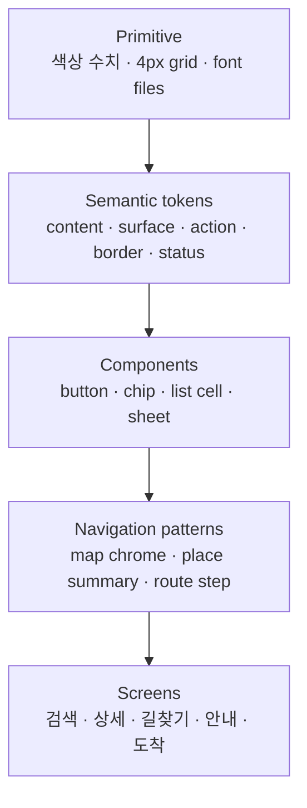

# Navigation 디자인 시스템 구축 계획 (v1)

이 문서는 Flutter 클라이언트의 색, 글자, 간격, 선, 모서리, 깊이와 반복 UI를
**위계와 규칙으로 결정하는 체계**로 전환하기 위한 실행 계획이다. 목표는 Material을
지우는 것이 아니라, Material은 접근성·플랫폼 동작·기본 상호작용을 제공하는 기반으로
남기고 **사용자에게 보이는 시각 결정은 Navigation 디자인 시스템이 소유**하게 하는 것이다.

결과물은 둘이다. 하나는 앱이 import하는 **개발용 시스템(Runtime Kit)**이고, 다른 하나는
브랜드·토큰·컴포넌트·실제 화면 적용을 사람이 탐색하는 **시각 시스템(Showcase & Lab)**이다.
둘을 별도 디자인 시스템으로 만들지는 않는다. 같은 토큰과 실제 Flutter 컴포넌트를 두
표면에서 사용해야 “전시 페이지는 예쁜데 앱은 다른” 상태를 막을 수 있다.

구현에 들어가기 전에 완료 판정과 실패 조건을 먼저 고정한다. 각 단계는 독립 PR과
한국어 커밋으로 진행하고, 아래 검증 기준을 통과하기 전에는 다음 단계로 넘어가지 않는다.

## 현재 분리 상태

| 항목 | 상태 | 근거 |
|---|---|---|
| 별도 로컬 작업 폴더 | 완료 | `navdesignsystem+promo/` |
| 프로모션 코드 이동 | 완료 | `apps/promo_studio/`에서 독립 실행 |
| 프로모션 정적 분석·웹 빌드 | 완료 | `flutter analyze`, `flutter build web` 통과 |
| 디자인 시스템 계획 이동 | 완료 | 이 문서가 단일 출처 |
| Runtime Kit package | 기반 구축 중 | semantic foundation, layout primitive, `RoutexButton`·`RoutexListCell` beta |
| Showcase & Lab | 최소 Showcase 완료 | Runtime Kit을 path dependency로 직접 import |
| 검증 workflow | 완료 | Runtime Kit analyze/test, Showcase analyze/test/web build, Promo analyze/web build |
| Git 저장소·GitHub 원격 | 완료 | 공개 `Routex-labs/routex-design-system` |
| Navigation 앱 package 연동 | 미착수 | 첫 release tag 이후 진행 |

현재 Promo Studio의 `lib/theme/app_theme.dart`는 독립 실행을 위한 임시 snapshot이다.
Runtime Kit가 생기면 package import로 교체하고 이 사본을 제거한다.

현재 package의 `0.0.1`은 monorepo 공급과 Showcase import를 확인하는 bootstrap 버전이다.
토큰 수치와 `RoutexButton`·`RoutexListCell` API는 pilot 전이므로 beta이며, Navigation은 이를
소비하지 않는다.

### 3인 팀의 v0.1 범위 제한

현재 폴더 구조는 유지한다. 다만 세 명이 제품 전체를 개발하고 그중 한 명이 디자인 시스템과
Promo Studio를 주로 운영하므로, 첫 버전은 “완전한 사내 플랫폼”이 아니라 **반복되는 결정을
줄이는 작은 제품 도구**로 만든다. 자동 문서 생성, 다중 테마, 수십 개 컴포넌트, 모든 화면
이관은 v0.1의 성공 조건이 아니다.

실행 우선순위는 다음 순서를 바꾸지 않는다.

1. 색상·타이포그래피·간격·곡률·그림자·모션 토큰 체계
2. 실제 반복 사용량이 높은 핵심 컴포넌트 6~10개
3. Runtime Kit package를 실제로 import하는 최소 Showcase
4. Promo Studio의 핵심 장면 완성
5. Navigation의 대표 화면 1~2개에 시범 적용

새 추상화나 도구가 이 다섯 결과 중 하나를 직접 개선하지 않으면 v0.1 이후로 미룬다.

---

## 1. 먼저 정하는 완료 판정

디자인 시스템 v1은 다음 조건을 모두 만족하면 완료로 본다.

- 앱 제품 UI에서 새 `Color(0x...)`, 임의 `fontSize`, 임의 `EdgeInsets`, 임의
  `BorderRadius`를 추가하면 CI가 실패한다. 지도 렌더러·홍보 영상·디버그 UI처럼
  의도적인 예외는 파일 단위 allowlist와 이유를 갖는다.
- 제품 UI의 색은 원시 색 이름이 아니라 `contentPrimary`, `surfaceRaised`,
  `actionPrimary` 같은 **용도 이름**으로만 사용한다.
- 글자 크기·굵기·행간 조합은 정의된 역할만 사용한다. `12.5`, `13.5`, `14.5`처럼
  화면마다 생긴 중간값이 없다.
- 간격, 모서리, stroke, 아이콘 크기, 터치 영역이 토큰 집합 안에서만 결정된다.
- 버튼·아이콘 버튼·칩·리스트 행·카드·시트·검색 입력은 공통 컴포넌트를 사용하고,
  화면에서 다시 그리지 않는다.
- 지도 홈, 검색, 장소 상세, 길찾기 초안, 안내 중, 도착의 대표 상태가 같은 정보 위계로
  읽힌다. 한 화면에서 가장 강한 기본 행동은 하나뿐이다.
- 360px 폭, 텍스트 배율 1.0/1.3/2.0, 긴 한글 매장명, 빈 값, 로딩, 오류, 비활성 상태를
  포함한 golden/widget 테스트를 통과한다.
- 모든 상호작용은 최소 48×48dp 터치 영역을 확보하고, 텍스트/아이콘 대비는 WCAG 2.2
  AA를 만족하며, 색만으로 상태를 전달하지 않는다.
- 디자인 시스템 카탈로그에서 토큰과 공통 컴포넌트의 모든 상태를 한 화면씩 확인할 수 있다.
- 같은 역할의 제목·본문·메타정보·아이콘은 화면이 달라도 같은 시작선과 baseline을 사용하고,
  제목–본문–메타정보 사이의 세로 리듬이 공통 계약과 일치한다.
- Showcase에서 브랜드 원칙 → foundation → component → Navigation pattern → 실제 화면으로
  이어지는 이유를 비개발자도 이해할 수 있고, Lab에서는 같은 컴포넌트의 상태·화면 폭·
  텍스트 배율을 개발자가 조절해 검수할 수 있다.

여기서 v1은 장기적인 제품 적용 완료 상태다. 첫 배포인 `v0.1.0`은 토큰, 핵심 컴포넌트
6~10개, 최소 Showcase, package 공급 경로와 Navigation 1~2개 pilot이 검증되면 충분하다.

### 시스템이 실패한 것으로 보는 신호

- “이 화면만 조금 달라서”라는 이유로 원시 값을 직접 넣어야 한다.
- 같은 의미의 요소가 위치에 따라 다른 이름·높이·radius·글자 위계를 가진다.
- 브랜드 색이 선택, 성공, 길찾기 경로, 실내 카테고리를 동시에 뜻한다.
- 그림자가 장식으로 쓰이거나, stroke와 그림자가 같은 경계를 중복해서 표현한다.
- 텍스트 배율을 키웠을 때 잘리는 문제를 글자 크기를 줄여서 해결한다.
- Material 기본 컴포넌트를 직접 쓴 화면과 공통 컴포넌트를 쓴 화면이 섞여 보인다.
- 지도 그래픽용 색을 일반 UI 토큰으로 끌어오거나 그 반대가 발생한다.
- Navigation 앱이 디자인 시스템의 `main` branch나 개인 로컬 경로를 직접 의존한다.
- spacing token은 존재하지만 화면마다 임의 padding·`SizedBox`를 더해 텍스트 시작선과
  행간 리듬이 다시 달라진다.
- 같은 `ListCell` 역할의 제목·메타정보 또는 아이콘이 화면에 따라 다른 baseline에 놓인다.

---

## 2. 현재 상태 진단

`client/lib/theme/app_theme.dart`에는 색, 일부 컴포넌트 테마, 지도 오버레이의 세 단계
elevation이 있다. Pretendard도 전역 적용되어 있다. 출발점은 있으나 현재는
**토큰 모음이지, 사용을 강제하는 디자인 시스템은 아니다.**

2026-08-14 기준 `client/lib/promo/`를 제외한 187개 Dart 파일을 단순 정적 집계하면:

| 직접 표현 | 발생 수 | 포함 파일 수 | 문제 |
|---|---:|---:|---|
| `TextStyle(...)` | 176 | 38 | 역할 대신 화면별 크기·굵기 조합 |
| `EdgeInsets...(...)` | 166 | 43 | 4px 배수와 무관한 여백이 섞일 수 있음 |
| `BorderRadius...(...)` | 69 | 34 | 6·9·10·11·12·13·14·15·16·18·20·22·24·26·28·999 등 의미 불명 |
| `Colors.*` 또는 `Color(0x...)` | 497 | 52 | 제품 UI와 지도 렌더링 색의 책임이 섞임 |

이 수치는 모두 제거할 위반 수가 아니다. `floor_plan_view.dart`의 도면·마커 페인트,
대중교통 노선색, 디버그 오버레이처럼 데이터 시각화에 필요한 값도 포함한다. 0단계에서
**제품 chrome / 지도 의미색 / 데이터색 / 홍보·디버그 예외**로 먼저 분류해야 한다.

현재 유지할 좋은 기반도 있다.

- `AppElevation.onMap / chrome / overlay`는 지도 위 UI 위계를 이미 의미로 표현한다.
- `AppColors.hairline`은 그림자 대신 경계가 필요한 이유가 문서화돼 있다.
- `map_palette.dart`, `map_route_style.dart`, 카테고리 스타일 헬퍼는 기능 가까이에서
  지도 표현을 소유한다.
- Pretendard 400·500·600·700·800이 등록되어 플랫폼별 폰트 차이를 막는다.

따라서 전면 재작성보다 **기존 의미 있는 규칙은 승격하고, 화면별 결정을 점진적으로
흡수하는 방식**이 안전하다.

### 2.1 부족한 영역 전체 지도

곡률·여백·크기가 제각각인 것은 아래 문제들이 화면에 드러난 결과다.

| 부족한 축 | 현재 문제 | 필요한 계약 |
|---|---|---|
| 브랜드·제품 원칙 | Material 기본 인상과 화면별 장식이 정체성을 대신함 | 차분함·명료함·신뢰감을 판단 기준으로 사용 |
| 정보 위계 | 제목·CTA·상태·보조정보가 같은 강도로 경쟁 | P0~P4 우선순위와 화면당 기본 CTA 하나 |
| Foundation | 색 일부 외 spacing/radius/stroke/size/motion이 분산 | semantic token과 제한된 scale |
| 컴포넌트 | 비슷한 버튼·칩·행·시트를 화면마다 재조립 | variant/state/accessibility가 닫힌 공통 API |
| 제품 패턴 | 부품은 비슷해도 검색·상세·길찾기 구조가 다름 | MapChrome 등 Navigation 고유 pattern |
| 상태·피드백 | loading/empty/error/disabled가 위치마다 다름 | 상태별 형태·문구·semantics 규칙 |
| 접근성·반응형 | 2배 글자, 긴 한글, 좁은 화면 검증이 일부에만 있음 | 폭·text scale·focus·contrast test matrix |
| 운영·배포 | 변경 승인, 폐기, 버전, 앱 적용 경로가 없음 | proposal부터 release/migration까지 lifecycle |

특히 **콘텐츠와 문장 규칙**도 디자인 시스템 범위다. 같은 오류를 스낵바·빈 화면·배너가
각기 다른 어조로 말하지 않도록 제목, 설명, 행동 문구의 순서와 voice/tone을 정의한다.
날짜·거리·층·ETA 표기 형식과 말줄임 우선순위도 component가 아니라 content foundation이
소유한다.

---

## 3. 우리 디자인 원칙

모든 새 화면과 컴포넌트는 아래 네 질문에 답해야 한다.

1. **지금 어디인가** — 실내/야외, 층, 현재 위치와 목적지의 관계가 먼저 읽힌다.
2. **다음에 무엇을 하면 되는가** — 화면의 기본 행동은 하나이며 가장 강한 위계를 갖는다.
3. **왜 이 결과인가** — 거리, 층, 카테고리, 검색어 일치처럼 선택 근거를 가까이에 둔다.
4. **상태가 바뀌었는가** — 로딩·선택·경로 전환·오류를 색 하나가 아니라 형태와 문구로 알린다.

시각 성격은 다음 세 단어로 제한한다.

- **차분함**: 지도와 콘텐츠가 경쟁하지 않는다. 넓은 중립면과 적은 강조색을 쓴다.
- **명료함**: 한 화면의 강조점과 계층 수를 제한한다. 장식보다 정렬과 여백으로 묶는다.
- **신뢰감**: 위치·시간·경로처럼 변하는 값은 과장하지 않고, 불확실성과 오류를 숨기지 않는다.

“Material처럼 보이지 않게” 하기 위해 임의 장식을 더하지 않는다. 고유성은 색 하나보다
**정보 우선순위, 지도와 시트의 연결 방식, 타이포 리듬, 일관된 공간 규칙**에서 만든다.

---

## 4. 시스템 계층



- **Primitive**는 시스템 내부 구현값이다. 제품 위젯이 직접 참조하지 않는다.
- **Semantic token**은 쓰임을 말한다. light/dark나 브랜드 조정은 이 층에서 교체한다.
- **Component**는 토큰으로 만든 독립 UI다. 상태와 접근성 계약을 함께 가진다.
- **Pattern**은 두 개 이상의 컴포넌트가 특정 사용자 과업을 수행하는 조합이다.
- **Screen**은 패턴을 배치하고 상태를 연결한다. 새로운 시각 규칙을 만들지 않는다.

예외가 필요하면 primitive를 화면에 노출하지 않고 component token을 추가한다. 예외의
이름, 사용하는 컴포넌트, 제거 조건을 문서화한다.

---

## 5. 위계 규칙

### 5.1 정보 위계

| 단계 | 사용자 질문 | 예시 | 표현 규칙 |
|---|---|---|---|
| P0 안전/안내 | 지금 즉시 무엇을 해야 하나 | “오른쪽으로 이동”, 층 전환 | 가장 큰 제목 + 동작 아이콘, 다른 강조와 공존 금지 |
| P1 현재 과업 | 무엇을 선택/확정하나 | 목적지, 기본 CTA, ETA | 화면당 기본 CTA 하나, brand action 사용 |
| P2 판단 근거 | 왜 이것을 고르나 | 거리, 층, 업종, 영업 상태 | 본문/라벨 위계, P1보다 낮은 대비 |
| P3 보조 정보 | 더 알아야 할 것이 있나 | 설명, 출처, 부가 메타 | 접거나 아래로 배치, 핵심 동작을 밀어내지 않음 |
| P4 개발 정보 | 제품 사용과 무관 | 좌표, 센서, API 상태 | debug mode에서만 노출 |

### 5.2 공간·레이어 위계

기존 `AppElevation`을 유지하되 규칙을 명확히 한다.

| 층 | 역할 | 예시 | 경계 규칙 |
|---|---|---|---|
| canvas | 공간 자체 | 야외/실내 지도, 경로선 | UI shadow 없음 |
| onMap | 지도에 붙은 조작 | 층 선택, 재중앙, 카테고리 | 1dp elevation 또는 hairline 중 하나 |
| chrome | 항상 있는 과업 UI | 상단 검색, ETA, 하단 모드 | 3dp, 지도와 구별되는 surface |
| contextual | 선택한 대상 | 장소 요약 카드, 후보 목록 | chrome보다 정보 우선, overlay보다 낮음 |
| overlay | 현재 과업의 주인공 | 상세 시트, 경로 선택, 오류 | 8dp, 배경 차단/포커스 이동 규칙 포함 |

그림자는 z-order를 알리는 기능일 때만 쓴다. 같은 층의 카드들을 “더 예쁘게” 보이게 하려고
각기 다른 그림자를 주지 않는다.

### 5.3 상호작용 위계

시각적 elevation과 사용자 흐름 차단 정도를 따로 결정한다. 같은 높이로 보이는 요소라도
접근성·뒤로가기·포커스 계약이 다를 수 있다.

| 단계 | 동작 | Routex 예시 | 규칙 |
|---|---|---|---|
| inline | 같은 자리에서 즉시 상태 변경 | 카테고리 필터, 층 선택 | 가장 먼저 고려, 결과를 가까이 표시 |
| non-modal overlay | 지도 조작을 유지한 보조 정보 | 장소 요약, snackbar | 기반 콘텐츠 접근 가능, 자동 포커스 탈취 금지 |
| modal | 기반 콘텐츠를 잠시 차단 | 장소 상세·경로 선택 시트 | 동시에 하나만, 포커스 가두기·복귀·닫기 제공 |
| new page | 여러 단계의 복잡한 과업 | 전체 길찾기 설정, 설정 화면 | modal을 중첩하지 않고 독립 navigation 사용 |

새 UI를 만들 때 “어떤 그림자인가”보다 먼저 어느 상호작용 단계인지 정한다. modal 위에
modal을 다시 열어야 한다면 기존 것을 교체하거나 새 page로 승격한다.

---

## 6. Foundation v1 규칙

수치는 0단계의 실제 화면 캡처와 접근성 검증 후 확정한다. 아래는 v1 후보군이며,
컴포넌트가 요구하지 않는 토큰은 미리 늘리지 않는다.

### 6.1 색

- Primitive: neutral과 brand blue의 단계값, status 색을 내부에 둔다.
- Semantic: `surfaceCanvas`, `surfaceBase`, `surfaceRaised`, `surfaceScrim`,
  `contentPrimary`, `contentSecondary`, `contentDisabled`, `contentInverse`,
  `actionPrimary`, `actionPrimaryPressed`, `borderSubtle`, `borderStrong`,
  `statusSuccess/Warning/Error`, `focusRing`으로 시작한다.
- `blue50`, `blue500` 같은 숫자 이름은 foundation 밖에서 금지한다.
- `primary`와 `indoor`처럼 거의 같은 색에 서로 다른 의미를 부여한 현재 구조는 해소한다.
- 지도 도면, 경로, POI, 대중교통 노선색은 별도 `MapVisualTokens`로 두고 UI semantic
  token과 1:1로 묶지 않는다.
- 카테고리색은 분류 보조다. 본문 텍스트, CTA, 오류 의미로 재사용하지 않는다.

### 6.2 타이포그래피

Pretendard를 유지하고 역할을 7개 안팎으로 제한한다.

| 역할 | 후보 크기/굵기 | 용도 |
|---|---|---|
| display | 28/800 | 도착·완료처럼 화면당 한 번 |
| headline | 20/800 | 장소명, 안내 핵심 |
| title | 16/700 | 시트·섹션 제목 |
| body | 14/400 | 기본 본문 |
| bodyStrong | 14/700 | 목록의 이름·판단값 |
| label | 12/600 | 칩, 배지, 보조 액션 |
| caption | 11/500 | 출처·시간 등 정말 낮은 위계 |

- 행간도 역할에 포함한다. 화면에서 `copyWith`로 크기·굵기를 바꾸지 않는다.
- 색 변경, 말줄임, 장식은 허용하되 역할 자체를 재조합하지 않는다.
- 숫자 ETA처럼 tabular figure가 필요한 경우 별도 숫자 역할을 검토한다.
- 2.0 배율에서 줄바꿈을 허용하고 높이가 늘어나야 한다. 고정 높이로 자르지 않는다.

### 6.3 간격과 레이아웃

- 4px base grid: `0, 4, 8, 12, 16, 20, 24, 32, 40`만 v1에 둔다.
- 같은 컴포넌트 내부는 4/8/12, 컴포넌트 padding은 12/16, 섹션 사이는 24/32를 우선한다.
- 화면 좌우 gutter는 compact 16, 넓은 화면 24를 기본으로 한다.
- 빈 공간은 구조를 설명해야 한다. 숫자가 같아도 “내부 padding”과 “형제 gap” 토큰은
  API에서 역할을 구분한다.
- 방향성 API(`start/end`, `EdgeInsetsDirectional`)를 사용한다.

#### 6.3.1 텍스트 리듬과 정렬 계약

사용자가 가장 자주 체감하는 문제는 개별 spacing 수치보다 **시작선, baseline과 텍스트 사이
리듬이 화면마다 달라지는 것**이다. 따라서 정렬은 화면 작성자의 미세 조정이 아니라 공통
컴포넌트가 소유한다.

- 같은 계층의 콘텐츠는 공통 screen gutter와 열(column) 시작선을 공유한다. 검색 결과,
  즐겨찾기와 장소 목록의 제목 열이 서로 다른 x 좌표에서 시작하지 않는다.
- 제목·본문·메타정보 사이 간격은 typography 역할 조합별 계약으로 둔다. 예를 들어
  `title → body`, `bodyStrong → caption` 간격을 화면에서 다시 정하지 않는다.
- 아이콘의 외곽 bounding box가 아니라 live area의 시각 중심과 텍스트 baseline을 맞춘다.
  leading icon 유무가 텍스트 열의 시작선을 바꾸지 않도록 컴포넌트 variant가 열을 소유한다.
- 컴포넌트 내부 padding, 형제 요소 gap, 섹션 간격을 서로 다른 semantic token으로 사용한다.
  같은 숫자여도 역할을 섞지 않는다.
- 빈 subtitle, 두 줄 제목, 긴 한글, 숫자·영문 혼합, text scale 1.0/1.3/2.0에서 정렬선과
  콘텐츠 순서가 유지되어야 한다. 이를 고정 높이 또는 글자 축소로 해결하지 않는다.
- 화면별 임의 `EdgeInsets`, `SizedBox(height: 7)`, `Transform.translate`로 정렬을 보정하지
  않는다. 반복되는 차이는 component 계약을 수정하고 한 화면만의 요구는 `app-local`로 둔다.
- 2px optical correction은 수학적 중앙과 시각적 중앙이 다른 아이콘·glyph에만 허용한다.
  correction 이름, 대상, 근거와 제거 조건을 문서화하고 일반 spacing token으로 확산하지 않는다.

v0.1에서는 `ListCell`, `SearchField`, `Sheet`와 Button을 정렬 검수의 대표 대상으로 삼는다.
각 컴포넌트는 왼쪽 시작선, 텍스트 baseline, 제목–보조정보 간격을 fixture와 golden으로 고정한다.

#### 6.3.2 Layout primitive 실패 계약

Layout primitive는 편의 위젯이 아니라 임의 배치를 막는 경계다. 생성자에는 `double`,
`EdgeInsetsGeometry`, 임의 `alignment`를 받지 않고 아래 semantic role만 공개한다. 새 역할이
필요하면 기존 화면에서 수치를 넘기는 대신 계약과 테스트를 먼저 추가한다.

| primitive | 고정 계약 | 즉시 실패로 보는 조건 | 자동 검증 |
|---|---|---|---|
| `RoutexInset.screen` | start/end 16dp, top/bottom 24dp, directional inset | 값 변경, 물리 방향 기반 inset, 외부 임의 padding 추가 | LTR/RTL widget test |
| `RoutexInset.component` | 네 방향 16dp | 방향별 예외값 또는 외부 보정 추가 | widget test |
| `RoutexStack` | 첫·끝 0dp, 자식 사이만 4/8/12/24dp, 가로 stretch | 선행·후행 gap, 역할 외 수치, 자식 순서·폭 변경 | 크기·좌표 widget test |
| `RoutexCluster` | 가로·세로 gap 8/12dp, start 정렬, 자동 줄바꿈 | 축별 다른 gap, center 정렬, 좁은 폭 overflow | 320dp 이하 wrap test |
| Showcase section | 같은 부모 안에서 좌우 경계 일치 | 섹션마다 폭 또는 시작선이 달라짐 | 360/390dp rect 비교 |

360/390dp와 text scale 1.0/1.3/2.0 조합에서 overflow, 잘림, 겹침 또는 예외가 하나라도
발생하면 완료로 보지 않는다. 테스트를 통과시키기 위한 고정 높이, 글자 축소,
`Transform.translate`도 실패로 취급한다.

### 6.4 radius, stroke, elevation

- Radius 후보: `8`(작은 컨트롤), `12`(필드/리스트 묶음), `16`(카드),
  `24`(시트 상단), `full`(pill/원형).
- Stroke 후보: `1`(기본 경계), `1.5`(선택), `2`(focus/강한 상태).
- 경계는 surface 분리를, 선택선은 상태를, focus ring은 입력 초점을 뜻한다.
- elevation은 앞의 5단계 의미와 연결한다. 숫자를 화면에서 직접 넣지 않는다.

### 6.5 아이콘, 크기, 상태, 모션

- 아이콘은 16/20/24px로 제한하고 터치 영역과 시각 크기를 분리한다.
- 각 크기에 live area와 내부 padding을 정의한다. 작은 아이콘은 큰 아이콘을 단순 축소하지
  않고 세부를 줄여 같은 stroke와 시각 무게를 유지한다.
- 기본은 한 계열의 outline 아이콘, 선택 상태만 filled를 허용한다.
- 텍스트 옆 아이콘은 텍스트와 같은 semantic foreground를 사용한다. status icon만
  success/warning/error 색을 허용한다.
- hover/pressed/focused/selected/disabled/loading 상태를 모든 조작 컴포넌트가 지원한다.
- selected와 pressed처럼 상태가 동시에 적용될 때 하나가 다른 하나를 지우지 않도록
  additive state 조합표를 컴포넌트별로 둔다.
- motion은 `fast 120ms`, `base 200ms`, `slow 320ms` 후보로 시작하고,
  reduce motion에서 이동·확대 애니메이션을 제거한다.
- `fast`는 버튼·포커스 같은 micro interaction, `base/slow`는 sheet·화면 전환 같은
  macro interaction에 사용하고 enter/exit easing을 구분한다.
- 제품 앱의 지도 카메라 이동 시간은 UI motion과 분리해 Navigation의 `MapMotionTokens`가
  소유한다. 프로모션 카메라는 이 토큰을 사용하지 않고 Promo Studio가 별도로 소유한다.

#### Motion 소유 경계

Runtime Kit에는 여러 제품 화면이 반복해서 사용하는 **공통 Motion Token**과 Button, Chip,
Sheet, 상태 전환처럼 **제품 컴포넌트 자체의 모션**만 넣는다. 토큰은 duration, easing,
enter/exit와 reduced-motion 대체 동작을 정의하며, 특정 영상의 재생 시간이나 장면 순서를
표현하지 않는다.

프로모션의 카메라 이동, 파티클, 전체 타임라인, 장면 전환, 촬영용 easing과 영상 전용 asset은
`apps/promo_studio`가 소유한다. 프로모 앱은 색·타입·제품 UI에 쓰이는 공통 Motion Token을
공유할 수 있지만, 영상 연출을 위해 만든 값을 Runtime Kit으로 승격하지 않는다. 반대로
프로모 타임라인을 공통 토큰 길이에 억지로 맞추지도 않는다.

---

## 7. 별도 저장소와 코드 구조

### 7.1 결론

`Routex-labs/routex-design-system` 새 저장소를 만드는 방향을 권장한다. 현재 앱 저장소의
원격은 `Routex-labs/Navigation`이고, 2026-08-14 기준 조직에 공개된 저장소는 이 하나다.
디자인 시스템은 앱 기능과 릴리스 주기·독자·배포물이 다르므로 분리할 가치가 있다.

다만 **Runtime Kit와 Showcase를 서로 다른 두 저장소로 다시 쪼개지는 않는다.** 둘은 같은
토큰과 Flutter 컴포넌트를 사용해야 하며, 한 PR에서 코드·문서·시각 예시를 함께 검토해야
한다. 새 저장소는 작은 monorepo로 구성한다.

```text
Routex-labs/routex-design-system/
  packages/
    routex_design_system/       # 앱이 소비하는 Flutter package
      lib/
        src/
          foundations/
          theme/
          components/
          patterns/
      test/
  apps/
    showcase/                   # Flutter Web Showcase & Lab
      lib/
      test/
    promo_studio/               # 이미 이동한 결정론적 제품 영상 앱
  docs/                         # 원칙·사용/금지·마이그레이션의 단일 출처
  tooling/                      # literal guard, token/doc 생성 도구
  .github/workflows/            # analyze, test, golden, web build, release
```

저장소와 package 이름은 역할이 즉시 드러나는 `routex-design-system` /
`routex_design_system`을 우선안으로 삼는다. 별도 브랜드명이 정해지더라도 저장소를 다시
옮기지 않고 Showcase의 표시 이름만 바꿀 수 있다.

### 7.2 Navigation 앱이 소비하는 방식

- v0에서는 GitHub tag를 가리키는 Flutter git dependency로 연결한다.
- `Navigation`의 main은 `v0.1.0` 같은 정확한 tag 또는 commit을 pin한다. `main` branch를
  직접 바라보지 않는다.
- 로컬에서 두 저장소를 함께 고칠 때만 gitignore된 `pubspec_overrides.yaml`로 sibling
  checkout의 path dependency를 사용한다. 팀 공용 `pubspec.yaml`에 개인 경로를 넣지 않는다.
- 디자인 시스템 release PR → tag/release → Navigation dependency update PR 순서로
  움직인다. 두 저장소 변경을 한쪽 PR에 “나중에 반영”으로 남기지 않는다.
- submodule과 파일 복사는 사용하지 않는다. 업데이트가 어렵고 두 원본을 만들기 때문이다.

“필요한 것만 사용한다”는 것은 다음 두 층으로 이해한다.

- **코드:** package는 한 번 resolve하지만 앱은 필요한 public API만 import한다. Flutter/Dart
  release build는 참조되지 않는 코드를 tree shaking한다.
- **자산:** `pubspec.yaml`에 선언한 폰트·이미지는 코드처럼 항상 세밀하게 제거되지 않는다.
  무거운 지도·프로모션 자산은 core package에 넣지 않고 소비 앱 또는 별도 optional package가
  소유한다.

v1은 패키지 하나로 시작한다. foundation/components/patterns를 너무 일찍 여러 package로
나누면 호환 버전 조합과 release 순서가 더 복잡해진다. 독립 소비자와 무거운 optional asset이
실제로 생길 때만 package 분리를 검토한다.

초기 package 계약의 예시는 다음과 같다.

```yaml
dependencies:
  routex_design_system:
    git:
      url: https://github.com/Routex-labs/routex-design-system.git
      ref: v0.1.0
      path: packages/routex_design_system
```

현재 원격은 공개이며 Runtime Kit을 인증 정보 없이 clone·resolve할 수 있다. 공개 저장소라는
사실만으로 프로젝트 코드의 재사용 라이선스가 생기는 것은 아니므로 코드 라이선스는 팀이
별도로 결정한다. Pretendard font 파일은 함께 포함한 OFL을 따르며, 이후 비공개 브랜드 asset이
생기면 공개 package와 분리해 보관한다.

### 7.3 저장소 경계

새 저장소로 옮기는 것:

- primitive/semantic token과 `ThemeExtension`
- Material `ThemeData` 조립과 공통 컴포넌트
- 앱 모델에 의존하지 않는 Navigation pattern과 fixture
- Pretendard 적용 계약과 라이선스, 아이콘 규칙
- 공통 Motion Token과 제품 컴포넌트의 상태·진입·퇴장 모션
- Showcase & Lab, 문서, 접근성/golden test, literal guard 도구

`Navigation`에 남기는 것:

- MapLibre controller와 지도 source/layer, 실제 POI/경로 렌더링
- API 모델, repository, service locator, 라우팅, 온디바이스 Dijkstra
- 대중교통 사업자/노선처럼 데이터가 결정하는 색
- 앱 상태와 직접 결합한 screen composition

`apps/promo_studio`에만 두는 것:

- 영상 카메라 이동, 파티클과 촬영 전용 시각 효과
- 전체 타임라인, 장면 순서·전환, 촬영용 easing
- 영상 렌더링에만 필요한 이미지·지도 snapshot·기타 대용량 asset

`MapChrome`, `PlaceSummary`, `RouteInstruction` 같은 패턴은 앱 domain model을 import하지
않고 값과 callback만 받는 경우에만 package로 승격한다. 그렇지 않으면 먼저 Navigation
안에서 pilot으로 검증하고 API가 안정된 뒤 옮긴다. 이 경계를 지키지 않으면 디자인 시스템
package 업데이트가 앱 비즈니스 로직 변경을 강요하게 된다.

### 7.4 기존 앱과의 호환

- 기존 `AppTheme.light`는 한 번에 지우지 않고 package의 `RoutexTheme.light`를 감싸는
  facade로 시작한다. 소비처 전환이 끝난 PR에서 제거한다.
- Material component theme은 공통 컴포넌트의 안전한 기본값으로 설정한다. 제품 화면은
  Material 버튼을 직접 조립하지 않는다.
- `ThemeExtension`으로 semantic token을 읽어 향후 dark/high-contrast 테마를 교체한다.
- `MapVisualTokens`, `MapRouteStyle`, 카테고리 팔레트는 Navigation에 남기고, 공통
  primitive가 필요한 경우에만 package에 의존한다. package가 앱을 역참조하지 않는다.

기존 화면과 위젯은 전부 package로 옮기지 않고 먼저 다음 네 상태로 inventory한다.

| 상태 | 판단 기준 | 처리 방식 |
|---|---|---|
| stable | 여러 화면에서 일관되게 반복되고 API가 검증됨 | Runtime Kit의 공개 API로 제공 |
| beta | 반복 가능성은 높지만 variant·상태가 아직 변할 수 있음 | pilot에서 사용하되 변경 가능성을 표시 |
| deprecated | 대체 컴포넌트가 있고 신규 사용을 막아야 함 | 대체 경로와 제거 버전을 문서화 |
| app-local | 도메인·지도 상태에 강하게 결합됐거나 한 화면에만 필요 | Navigation에 유지하고 억지로 범용화하지 않음 |

기존 `AppTheme`과 반복 위젯은 호환 wrapper로 새 API를 감싸며 교체한다. pilot 화면에서
동작과 접근성이 검증된 뒤 소비처를 넓히고, 마지막 소비처가 사라진 release에서만 wrapper를
제거한다. 대규모 일괄 이동 PR은 만들지 않는다.

---

## 8. 두 산출물, 하나의 소스

### 8.1 Runtime Kit — 개발용 디자인 시스템

앱이 직접 import하는 production 코드다.

- semantic token과 `ThemeExtension`
- 공통 컴포넌트와 Navigation pattern
- semantics, focus, touch target, text scaling 계약
- golden/widget test와 raw literal CI guard
- migration guide, deprecated API와 대체 경로

Runtime Kit의 성공 기준은 “값을 찾기 쉽다”가 아니라 **시스템 밖의 임의 결정을 만들기
어렵다**는 것이다. 컴포넌트 API에 자유로운 `padding`, `radius`, `textStyle`을 열어 두지
않고 의미 있는 variant와 size만 제공한다.

### 8.2 Showcase & Lab — 보여주고 검수하는 시각 시스템

`apps/showcase/lib/main.dart`로 별도 실행하는 Flutter Web 카탈로그를 만든다. v1은 로컬에서
실행하고, 팀 공유가 필요해지는 시점에 정적 호스팅을 붙인다.

v0.1에서는 Welcome, Foundations, 핵심 Components와 state/viewport/text-scale 조절만 만든다.
Journey, 전체 접근성 도구, 상태 대시보드와 문서 자동 생성은 실제 사용 필요가 확인된 뒤
추가한다. 중요한 조건은 페이지 수가 아니라 **Showcase가 Runtime Kit package를 실제로
import해 같은 컴포넌트를 렌더링하는가**이다.

Showcase에는 **Alignment & Rhythm** 검수 화면을 둔다. 공통 세로 guide와 text baseline을
겹쳐 표시한 상태에서 Button, ListCell, SearchField, Sheet를 비교하며, leading icon 유무,
한 줄·두 줄·빈 메타정보, text scale 변화에도 시작선과 간격 계약이 유지되는지 확인한다.

장기적으로 한 사이트 안에 두 모드를 둔다.

| 모드 | 대상 | 보여주는 것 |
|---|---|---|
| Showcase | 기획·디자인·개발·이해관계자 | 브랜드 성격, 원칙, 색/타입/공간 리듬, 아이콘, motion, 실제 내비게이션 흐름 |
| Lab | 개발·QA | 컴포넌트 variant/state, compact/tablet, text scale 1.0~2.0, 긴 한글/빈 값/오류, semantics와 token 이름 |

정보 구조는 다음으로 고정한다.

1. **Welcome** — “차분한 공간 안내, 명료한 다음 행동, 신뢰할 수 있는 상태”를 실제 화면으로 설명
2. **Foundations** — color, type, spacing, radius, stroke, elevation, icon, motion과 사용 금지 예
3. **Components** — 상태표, 사용/금지 상황, 접근성, 실제 Flutter 렌더링
4. **Patterns** — MapChrome, PlaceSummary, RouteEndpoint, RouteInstruction, FloorControl
5. **Journeys** — 검색 → 장소 선택 → 길찾기 → 층 전환 → 도착의 대표 시나리오
6. **Accessibility Lab** — 대비, 2배 글자, reduce motion, focus/semantics 점검
7. **Alignment & Rhythm** — 시작선, baseline, 텍스트 역할 간격과 optical correction 검수
8. **Status** — proposal/beta/stable/deprecated와 변경 기록

Showcase를 Runtime Kit의 스크린샷 모음으로 만들지 않는다. **실제 컴포넌트를 import해
렌더링**하고, 문서의 토큰 표도 runtime token에서 생성한다. 설명 문장은 이 문서 계열을
단일 출처로 두고 Showcase에서는 링크하거나 빌드 시 가져온다. 색 값·상태 목록·버전 정보를
두 군데 손으로 복사하지 않는다.

### 8.3 Figma의 역할

Figma 라이브러리를 만들 경우 코드와 같은 `Component / Variant / State` 이름을 쓴다.
Figma-only 항목은 `proposal` 또는 `beta`, 코드와 1:1 대응하는 항목만 `stable`로 표시한다.
브랜드 showcase의 연출 이미지는 Figma가 맡을 수 있지만, 컴포넌트의 실제 동작·접근성·
크기 검증은 Runtime Kit와 Lab이 기준이다.

---

## 9. 컴포넌트와 패턴 우선순위

v0.1의 상한은 공통 컴포넌트 6~10개다. 아래 8개를 후보로 두되, 실제 inventory에서 두 화면
이상 반복되지 않거나 pilot에 필요하지 않은 항목은 `beta` 또는 `app-local`로 남겨도 된다.

### 1차 공통 컴포넌트

| 컴포넌트 | 필수 variant/state | 먼저 대체할 대상 |
|---|---|---|
| Button | primary/secondary/quiet/danger, loading/disabled | 상세·도착·길찾기 CTA |
| IconButton | standard/onMap/inverse, selected/disabled | 상단 바, 재중앙, 닫기 |
| Chip | filter/choice/status, selected/disabled | `filter_pill`, 카테고리, 이동수단 |
| Surface | flat/outlined/raised/overlay | 카드와 지도 overlay container |
| ListCell · beta | 1~2행, leading/trailing, selected/disabled | 검색·즐겨찾기·카테고리 매장 |
| SearchField | idle/focused/typing/loading/error | 상단 검색과 길찾기 두 칸 |
| Sheet | peek/medium/expanded, drag/close | 모든 bottom sheet frame/header |
| Status/Empty | info/success/warning/error/loading/empty | 검색 없음, 위치 오류, 도착 |

### 2차 Navigation 패턴

- **MapChrome**: 안전 영역, 상단 바, on-map control, 하단 카드의 간격·겹침 규칙.
- **PlaceSummary**: 이름 → 업종/층 → 거리/상태 → 기본 행동 순서.
- **RouteEndpointField**: 출발/도착 역할, 교환, 후보, 오류, 지도 선택 상태.
- **RouteInstruction**: 다음 행동(P0) → 거리/층(P2) → 보조 행동 순서.
- **FloorControl**: 현재 층, 이동 가능 층, 전환 중, 접근 불가 상태.

패턴은 공통 컴포넌트를 조합하지만 모든 것을 범용화하지 않는다. 실내 층 전환처럼 이
제품에만 있는 핵심 경험은 Navigation 패턴으로 명시적으로 소유한다.

---

## 10. 실행 순서와 PR 경계

아래 단계는 큰 조직처럼 모두 병렬로 진행하지 않는다. 한 명의 주 운영자가 앞 단계의 작은
산출물을 실제로 사용한 뒤 다음 단계로 이동한다. 0~3단계와 Promo Studio 핵심 장면,
Navigation pilot 1~2개가 v0.1의 범위이며, 나머지 화면 이관은 사용 결과를 보고 후속 release로
나눈다.

### 준비 단계 — 저장소 생성과 공급 계약

- **완료:** 로컬 작업 폴더를 만들고 Promo Studio와 이 계획 문서를 Navigation에서 옮겼다.
- **완료:** Promo Studio의 analyze와 web build로 독립 실행 경계를 확인했다.
- **완료:** 공개 `Routex-labs/routex-design-system` 원격과 package/showcase monorepo를 만들었다.
- 코드 라이선스와 이후 보호할 브랜드 자산 범위를 결정한다.
- **완료:** Runtime Kit analyze/test, Showcase analyze/test/web build와 Promo analyze/web build
  workflow를 만들었다. golden과 `v0.x.y` release 규칙은 다음 준비 작업이다.
- Navigation에서 tag pin과 로컬 `pubspec_overrides.yaml` 흐름을 작은 빈 package로 검증한다.
- 첫 Runtime Kit release 뒤 Promo Studio의 임시 `app_theme.dart`를 package import로 교체한다.

**통과 조건:** 인증하지 않은 새 clone과 GitHub Actions에서 개인 로컬 경로 없이 package
resolve, test, Showcase web build가 모두 성공한다. 아직 제품 스타일을 확정하기 전 이 공급
경로부터 고정한다.

Navigation 제품 화면은 공급 경로만 검증한 빈 package나 `main` branch를 사용하지 않는다.
토큰과 최소 컴포넌트가 포함된 `v0.1.0` tag가 만들어진 뒤 pilot 화면 1~2개부터 실제 적용한다.

### 0단계 — 감사와 화면 기준선

- 릴리스 화면을 홈/검색/상세/길찾기/안내/도착 상태로 캡처한다.
- 원시 값을 제품 UI, 지도, 데이터색, debug, promo로 분류한 inventory를 만든다.
- 대표 화면 6개와 실패 상태의 golden 기준선을 만든다.
- 기존 사용자 변경이 있는 파일은 inventory만 하고 수정하지 않는다.

**통과 조건:** 모든 직접 값이 “이관/유지/예외” 중 하나로 분류되고, 예외마다 이유와
소유자가 있다.

### 1단계 — Foundation과 테마 뼈대

- primitive/semantic token, typography, spacing, radius, stroke, size, motion을 만든다.
- `ThemeExtension`과 Material component theme을 연결한다.
- light theme만 먼저 완성하되 dark theme에서 바꿀 경계를 코드로 확보한다.
- 대비표와 토큰 사용/금지 예시를 문서화한다.

**통과 조건:** 카탈로그에서 토큰만으로 foundation을 볼 수 있고, 기존 화면은 시각 회귀
없이 새 테마 facade로 실행된다.

### 2단계 — 공통 컴포넌트

- Button과 ListCell vertical slice 이후 SearchField → Sheet를 우선하고, 실제 pilot 요구에 따라
  IconButton → Chip → Surface → Status를 추가한다.
- 각 컴포넌트 PR에 상태표, 접근성 semantics, 1.0/2.0 text scale 테스트를 포함한다.
- Navigation inventory에서 확인된 실제 사용 사례로 API를 정하되, 이 단계에서는 Showcase의
  고정 fixture로 먼저 검증한다. 제품 화면 이관은 `v0.1.0` 이후 pilot 단계에서 진행한다.

**통과 조건:** 모든 variant가 카탈로그와 테스트에 있고, 임의 style parameter로 시스템을
우회할 수 없다.

### 3단계 — Showcase & Lab

- `apps/showcase/` 독립 Flutter Web 앱과 반응형 카탈로그 shell을 만든다.
- 먼저 foundation, Button, Chip, ListCell, Sheet를 실제 코드로 전시한다.
- Showcase에는 제품 원칙과 실제 사용자 여정, Lab에는 state/viewport/text scale 조절을 둔다.
- 카탈로그용 예제 데이터는 production API에 의존하지 않는 고정 fixture로 만든다.
- 문서와 token/state 목록을 수동 복제하지 않는 생성 또는 import 경계를 만든다.

**통과 조건:** 앱과 카탈로그의 같은 컴포넌트가 동일 golden을 사용하고, 한쪽 token 변경이
다른 쪽에도 즉시 반영된다. 카탈로그는 백엔드·API key 없이 실행된다.

### v0.1 병행 트랙 — Promo Studio 핵심 장면

- 전체 영상 기능을 확장하기보다 현재 사용자 여정에서 제품 차별점이 가장 잘 드러나는 핵심
  장면을 먼저 완성한다.
- Runtime Kit의 foundation과 실제 제품 컴포넌트는 공유하되 카메라·파티클·타임라인·장면
  연출과 전용 asset은 Promo Studio 안에서 구현한다.
- 디자인 시스템 release를 막지 않도록 영상 렌더·asset 검증은 별도 workflow로 둔다.

**통과 조건:** 고정된 시간값이 재생 이력과 무관하게 같은 프레임을 만들고, 핵심 장면을
공통 package 없이 복제하지 않으며, 영상 전용 구현이 Runtime Kit public API에 노출되지 않는다.

### v0.1 마무리 — Navigation pilot 1~2개

- `v0.1.0` tag를 고정한 뒤 사용량이 높고 위험이 낮은 대표 화면 1~2개만 선택한다.
- 호환 wrapper로 기존 호출부를 유지하면서 token과 stable/beta component를 적용한다.
- pilot에서 발견한 차이는 즉시 범용 token을 늘리지 않고 component 수정, app-local 유지,
  후속 제안 중 하나로 분류한다.

**통과 조건:** Navigation이 `main`이나 로컬 path가 아닌 `v0.1.0`을 사용하고, 기존 동작·
접근성·지도 hit-test에 회귀가 없으며, pilot 결과와 migration 방법이 다음 release 계획에
반영된다.

### 4단계 — 가장 반복이 많은 흐름 이관

1. `search_panel.dart` + `route_field_results.dart`: ListCell, typography, 상태 UI 통일
2. `place_detail_sheet.dart` + `place_detail/`: Sheet, section, action 위계 통일
3. `category_stores_sheet.dart` + `favorites_sheet.dart` + `outdoor_poi_sheet.dart`:
   같은 목록 문법으로 통일

**통과 조건:** 이름/메타/상태/행동의 순서가 세 목록에서 같고, 긴 한글·빈 이미지·오류
상태에서 레이아웃이 깨지지 않는다.

### 5단계 — 지도 chrome과 길찾기 패턴 이관

- `map_top_bar`, `map_bottom_bar`, `eta_card`, `floor_selector`, recenter를 MapChrome으로 묶는다.
- 경로 초안/안내/층 전환/도착에서 P0~P3 정보 위계를 적용한다.
- 오버레이 hit-test, MapLibre pointer 전달, 카메라 이동은 시각 이관과 별도 회귀 테스트한다.

**통과 조건:** 모든 지도 모드에서 overlay 간격, z-order, 제스처 잠금, 안전 영역이 같고,
지도 조작이 UI 조작을 뚫고 실행되지 않는다.

### 6단계 — 가드레일과 잔여 제거

- CI에 제품 UI의 원시 style literal 신규 추가를 막는 검사와 좁은 allowlist를 넣는다.
- `AppColors`, 중복 위젯, 더 이상 쓰지 않는 상수와 호환 facade를 별도 커밋으로 제거한다.
- `client/lib/theme/README.md`, `widgets/README.md`의 단일 출처를 새 시스템 문서로 옮기고
  기존 문서는 링크만 남긴다.

**통과 조건:** allowlist가 지도/data visualization/debug/promo 경계만 포함하고, 제품 UI의
신규 컴포넌트는 디자인 시스템 import 없이 시각 스타일을 정의할 수 없다.

### 7단계 — 운영 규칙

- 새 컴포넌트 제안 양식: 문제, 기존 조합으로 못 푸는 이유, 상태표, 접근성, 사용/금지 예.
- 상태를 `proposal → beta → stable → deprecated → removed`로 관리한다.
- Figma를 도입할 경우 코드와 같은 이름/variant/state를 사용하고, 코드가 없는 디자인은
  beta로 표시한다.
- 변경 로그에 영향받는 화면과 migration 방법을 남긴다.

**통과 조건:** 팀원이 새 화면을 만들 때 원시 값부터 고르지 않고 기존 pattern/component를
찾는 흐름이 문서와 PR template에 반영된다.

---

## 11. 테스트 매트릭스

| 축 | 필수 값 |
|---|---|
| 화면 폭 | 360, 390, tablet 대표 폭 |
| 텍스트 | 1.0, 1.3, 2.0 |
| 콘텐츠 | 짧음, 긴 한글, 영문/숫자 혼합, 빈 값 |
| 상태 | idle, focused, pressed, selected, disabled, loading, empty, error |
| 지도 모드 | 야외, 실내, 검색, 길찾기 초안, 안내, 층 전환, 도착 |
| 접근성 | contrast AA, semantics label/role, focus order, 48dp target, reduce motion |
| 정렬·리듬 | 공통 gutter/열 시작선, text/icon baseline, 역할 간 세로 간격, optical correction |
| 플랫폼 | Android, iOS, 지원 웹 화면 |

golden은 픽셀 변화 자체를 전부 오류로 취급하지 않는다. 변경 의도가 설명된 경우 기준을
갱신하되, 다음 항목은 수동 승인 없이 갱신하지 않는다.

- 텍스트 잘림·겹침·말줄임 위치 변화
- 같은 역할의 텍스트 시작선·baseline·제목–메타정보 간격 변화
- leading icon 유무에 따라 공통 텍스트 열이 흔들리는 변화
- 기본 CTA가 둘 이상 같은 강조를 갖게 되는 변화
- focus/selected/error 상태가 사라지는 변화
- 지도 위 overlay의 위치·z-order·hit area 변화
- 대비 기준 미달 또는 의미색 역할 변경

---

## 12. 이번 계획의 범위 밖

- v1에서 dark mode를 출시하지 않는다. 다만 semantic token 구조는 막지 않아야 한다.
- 지도 도면 자체를 일반 UI 팔레트로 다시 칠하지 않는다. 지도는 별도 시각 시스템이다.
- Material 아이콘 전체를 한 번에 커스텀 아이콘으로 교체하지 않는다. 먼저 크기·스타일·상태
  규칙을 고정하고, 고유 아이콘은 길찾기/층 전환처럼 제품 핵심 경험부터 만든다.
- promo studio와 홍보 영상 장면은 제품 UI 이관 대상이 아니다.
- 백엔드 API와 온디바이스 Dijkstra 계약은 변경하지 않는다.

---

## 13. 레퍼런스 검토와 Routex 적용 결정

2026-08-14에 각 사이트의 소개 화면이 아니라 foundation, interaction, accessibility,
component, migration 문서를 다시 확인했다. 아래 표의 “Routex 결정”만 우리 시스템의
규칙이며, 레퍼런스 수치 자체는 요구사항이 아니다.

| 레퍼런스에서 확인한 것 | Routex 결정 | 그대로 복사하지 않는 것 |
|---|---|---|
| [Skyscanner Backpack 계층](https://www.skyscanner.design/latest/getting-started/backpack-in-figma/foundations-components-and-patterns-4b5yBAjl): foundation→component→pattern, core와 product pattern의 소유 분리 | Runtime Kit은 core를, Routex Navigation pattern은 domain 조합을 소유 | 여행사 컴포넌트 이름과 수치 |
| [Backpack layout primitive](https://www.skyscanner.design/latest/layout/layout-primitives/overview-tVO0yQeg): Box/Stack/Flex/Grid가 시각 스타일과 분리되어 spacing·정렬을 통제 | `RoutexInset`, `RoutexStack`, `RoutexCluster`만 먼저 두고 semantic role과 실패 테스트로 API를 제한 | 모든 Container를 wrapper로 감싸는 과도한 추상화 |
| [Backpack spacing](https://www.skyscanner.design/latest/foundations/spacing/overview-jCiTHnBD): 반복 scale과 component/section 간격 구분 | 4px scale을 쓰되 component 내부와 section 간격의 의미 이름을 분리 | 큰 웹 여백을 모바일 지도에 적용 |
| [Backpack icon](https://www.skyscanner.design/latest/foundations/icons/overview-GqEdq0zt): 크기별 live area·padding·stroke와 텍스트 색 연동 | 16/20/24별 optical rule과 semantic foreground를 아이콘 계약에 포함 | 전체 커스텀 아이콘을 v1에서 한꺼번에 제작 |
| [Wanted Montage Foundation](https://montage.wanted.co.kr/docs/foundations)과 [Grid](https://montage.wanted.co.kr/docs/foundations/base-material/grid): typography/grid/icon/elevation의 명시적 scale, 대표 viewport | 360·375·390과 tablet 대표 폭으로 golden을 만들고 4px 기본, 2px optical correction만 허용 | 8px grid와 웹 breakpoint를 그대로 채택 |
| [Wanted component 분류](https://montage.wanted.co.kr/docs/components): action/content/feedback/navigation/presentation/input | 카탈로그 탐색 분류로 사용하되 개발 API는 역할보다 재사용 경계를 우선 | v1부터 전체 목록을 채우는 것 |
| [SEED token 계층](https://seed-design.io/docs/foundation/design-token): scale token과 semantic token의 2단 구조 | raw→scale→semantic 경계를 코드와 문서 양쪽에서 동일하게 유지 | 모든 scale을 public API로 노출 |
| [SEED State](https://seed-design.io/docs/foundation/state): interaction state와 option state가 함께 적용될 수 있음 | selected+pressed, selected+focused 같은 additive state 조합을 테스트 | 상태마다 별도 위젯 생성 |
| [SEED Motion](https://seed-design.io/docs/foundation/motion): micro/macro, enter/exit timing 구분 | 기능 micro motion과 sheet/page macro motion을 분리하고 reduce motion 제공 | 숫자와 easing의 무비판적 복사 |
| [SEED Inclusive Design](https://seed-design.io/foundations/inclusive-design): 색 외 수단, target, 대체 텍스트, 오류, 글자 설정, motion 제어 | 48dp 기본 target, semantics, 2배 글자, 오류 복구 행동을 release gate로 사용 | APCA만으로 합격을 판정 |
| [SEED Voice & Tone](https://seed-design.io/docs/foundation/voice-and-tone): 문장도 일관된 제품 경험의 foundation | Routex 문장은 명확함·간결함·불확실성 공개를 원칙으로 하고 상태별 문구 구조를 고정 | 당근의 친근한 말투 |
| [eBay product color](https://playbook.ebay.com/foundations/color/using-color-in-product): product palette를 marketing·data visualization과 분리하고 semantic token으로 mode/theme 대응 | 제품 UI, 지도/data color, promo 표현 팔레트를 서로 다른 library로 둠 | eBay의 다색 브랜드 팔레트 |
| [eBay interaction level](https://playbook.ebay.com/foundations/interaction-levels): on-page→above-page→modal→new-page, modal 하나 | 5.3의 상호작용 위계와 modal 중첩 금지로 반영 | desktop 중심 예시 |
| [eBay interaction state](https://playbook.ebay.com/foundations/interaction-states): subtle·additive·consistent 상태 변화 | 공통 state layer와 focus ring을 component API에 포함 | hover를 모바일의 핵심 상태로 취급 |
| [Meta Astryx](https://astryx.atmeta.com/): opinionated foundation, themeable component, flexible pattern, 실제 사용을 통한 기여 | foundation API는 엄격하게, pattern 조합은 유연하게 한다. v0.1에서는 Showcase fixture로 먼저 검증하고 Navigation pilot을 통과한 API만 stable로 승격 | 160개 이상 component 규모 |
| [SOCARFRAME 원칙](https://socarframe.socar.kr/development/principle): legacy 존중, 예측 가능성, affordance, consistency | Material의 익숙한 동작은 유지하고 시각 언어만 점진적으로 교체; 다음 행동과 복구가 예측 가능해야 함 | 기존 앱을 한 번에 재작성 |
| [SOCARFRAME 설치·마이그레이션](https://socarframe.socar.kr/development/foundation): versioned package, 구버전 병행과 deprecation | facade를 둔 단계적 migration과 tag pin을 공식 경로로 사용 | 두 버전을 기한 없이 병행 |
| [호랑에듀 단아 사례](https://avanturation.com/portfolio/horang): 브랜드→라이브러리→제품 UI 연결, 2배 글자, 실제 서비스 clone 검증 | 대표 Navigation journey와 실패 상태를 실제 component로 Showcase에 렌더링 | 포트폴리오용 정적 이미지가 구현 검증을 대신하는 것 |

### Routex가 레퍼런스보다 더 명확히 가져갈 경계

1. **지도는 background가 아니다.** UI chrome과 별도로 지도 canvas·route·POI·camera의
   시각 및 상호작용 계약을 둔다.
2. **제품과 프로모션은 같은 브랜드, 다른 표현 팔레트다.** 공통 foundation을 공유하되
   프로모션의 gradient·expressive motion을 제품 component token으로 역수입하지 않는다.
   공통 Motion Token과 제품 컴포넌트 모션만 Runtime Kit이 소유하며, 카메라·파티클·타임라인·
   장면 연출과 영상 asset은 Promo Studio가 소유한다.
3. **접근성 합격 기준은 WCAG 2.2 AA다.** APCA는 더 나은 조합을 찾는 보조 진단으로 함께
   기록하되 단독 release gate로 사용하지 않는다.
4. **수보다 적용률을 본다.** v1 목표는 170개 component가 아니라 적은 토큰, 8개 공통
   component, 5개 Navigation pattern이 대표 흐름에서 예외 없이 쓰이는 상태다.
