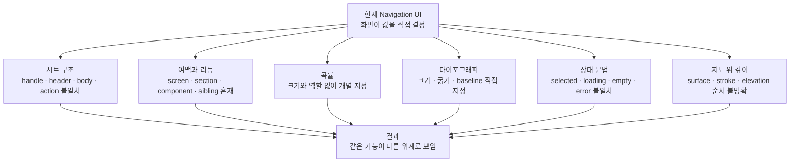
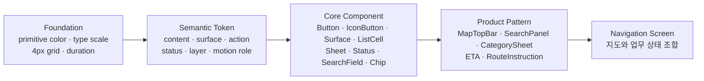
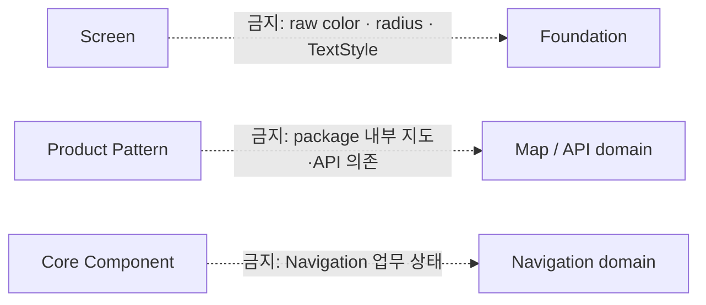
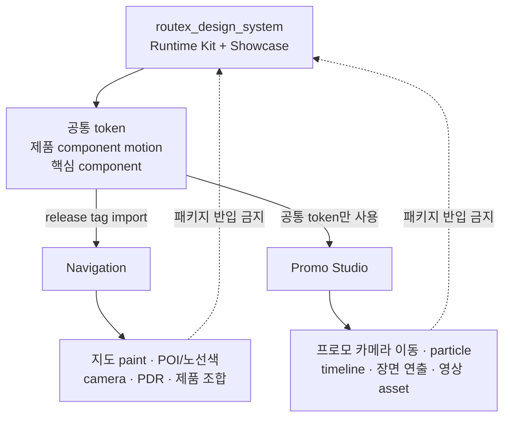
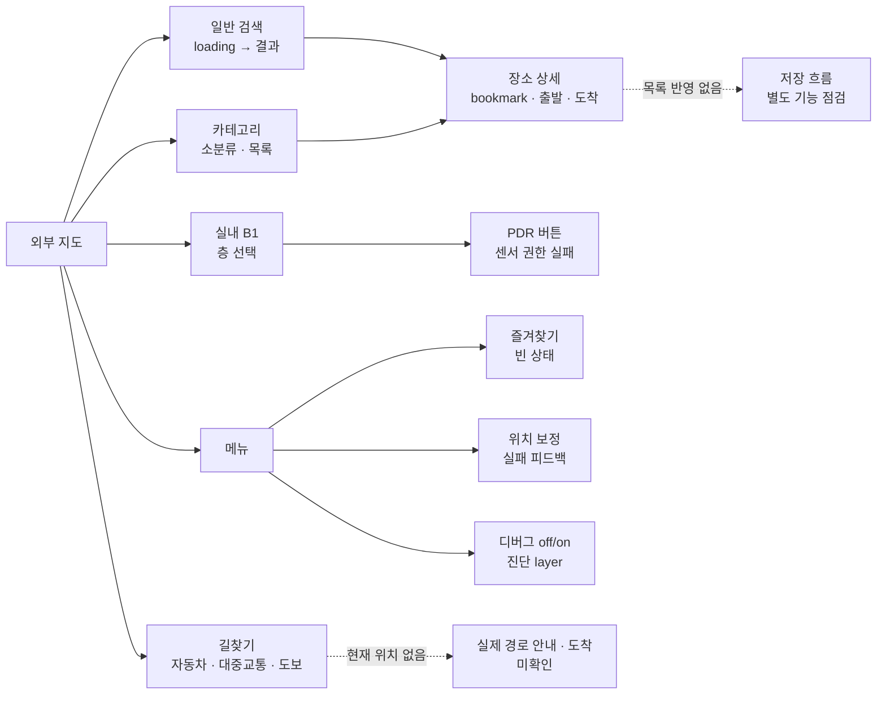
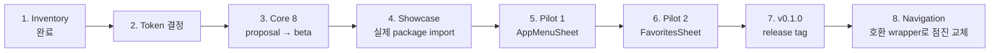

# Navigation UI 시각 지도

이 문서는 Navigation UI의 현재 문제, Routex Design System의 규칙 구조, 저장소별 소유권과
적용 순서를 빠르게 공유하기 위한 시각 색인이다. 수치와 판정 근거의 단일 출처는
[Navigation UI inventory](./navigation-ui-inventory.md)다.

## 1. 현재 UI 문제 지도

## 2. 규칙이 내려오는 순서

화면이 primitive 값을 직접 고르지 않는다. 아래 단계에서 바로 위 단계의 의미를 조합한다.

규칙을 건너뛰는 의존은 허용하지 않는다.

## 3. 저장소와 모션 소유권

## 4. 런타임에서 확인한 상태

## 5. v0.1 적용 순서

단계별 통과 조건은 inventory의
[pilot 선정](./navigation-ui-inventory.md#8-pilot-선정)과
[다음 token PR의 결정 항목](./navigation-ui-inventory.md#9-다음-token-pr의-결정-항목),
[v0.1 foundation token 계약](../decisions/0001-foundation-tokens.md)을 따른다.
